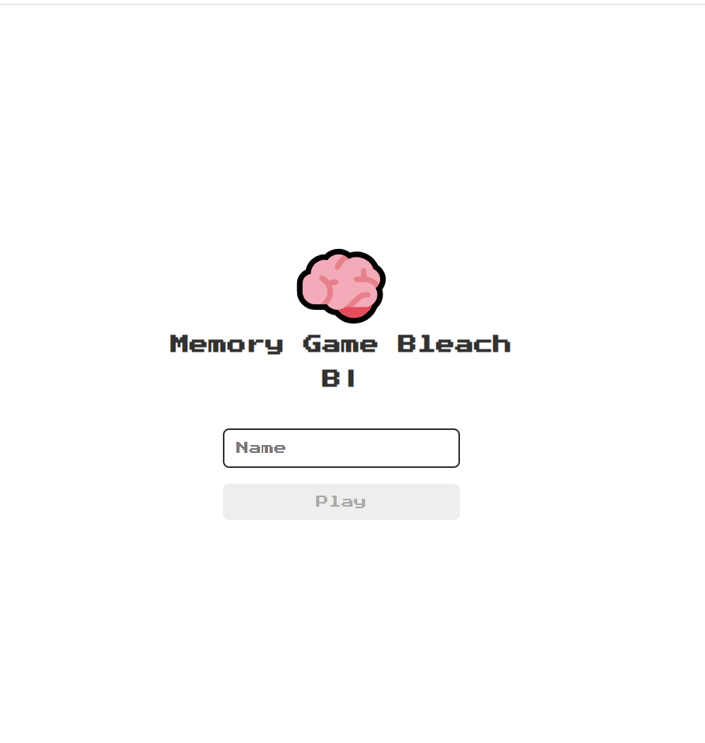

# memory-game

### Jogo da memoria com os personagens de bleach

---

### 📺 apresentação 


--- 

### ✔️ Pré-requisitos
Antes de rodar, você vai precisar ter instalado em sua máquina as seguintes ferramentas:

- Visual studio code
  - instalar a extensão Live server
   
---
  
### 🏁 Rodando o projeto
```
# Clone este repositorio
 git clone https://github.com/will4cod/memory-game
 
 # Acesse a pasta do projeto
 cd memory-game
 
 # Para abrir o projeto no visual studio  
 code .

 # Execute a aplicação
 Clique no botão **Go Live** (Canto inferior direito da tela)
 
```
---

 🔧 Tecnologias

- HTML
- CSS
- JavaScript

---

### 🚧 features do projeto

- [x] Fazer a tela de login.
- [X] Fazer as cards.
- [x] Adicionar as regras do jogo.
- [ ] Botão de jogar novamente.

---

Made with 💙 by will4cod <a href="https://www.linkedin.com/in/william-fernandes-4806a0173/" target="_blank">linkedin</a>
